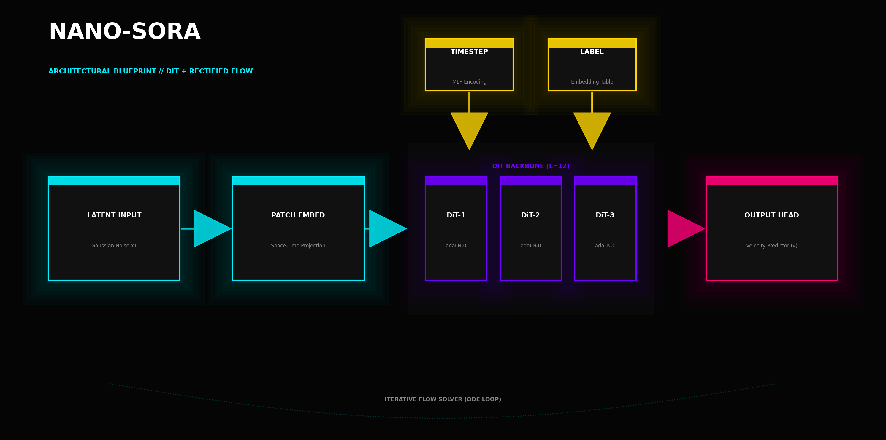

# 🌌 Nano-Sora: Diffusion Transformer Explorer


**Nano-Sora** is a high-fidelity implementation and exploration tool for **Diffusion Transformers (DiT)**. It leverages the state-of-the-art `facebook/DiT-XL-2-256` model to generate class-conditional images conditioned on ImageNet labels. The project features a premium "Glassmorphism" UI built with Streamlit, enabling users to interactively explore the capabilities of Transformer-based diffusion models.

---

## 📐 Architectural Blueprint

Nano-Sora implements the **Diffusion Transformer (DiT)** architecture, which replaces the traditional U-Net backbone of Latent Diffusion Models (LDMs) with a Transformer. It operates on patchified latent representations and uses **Flow Matching** (approximated via DPM-Solver) for generation.



### Key Components

| Component | Description |
| :--- | :--- |
| **Latent Space** | The model operates on a compressed latent space (32x32x4) rather than pixel space, enabling efficiency. |
| **Patchify** | Latents are broken into sequences of patches (2x2), similar to ViT (Vision Transformer). |
| **DiT Blocks** | Standard Transformer blocks conditioned via **Adaptive Layer Norm (adaLN)** which injects timestep and class information. |
| **Conditioning** | Class labels and timesteps are embedded and modulated into every block of the network. |

---

## 🚀 Features

- **Transformer Backbone**: Uses `DiT-XL/2` (Extra Large, patch size 2) for superior image quality.
- **Optimized Inference**: Utilizes `DPMSolverMultistepScheduler` for fast high-quality generation in just 20-50 steps.
- **Premium UI**: A custom-styled Streamlit interface with a "Glassmorphism" aesthetic, dark mode, and fluid animations.
- **Efficient**: Runs on consumer GPUs (RTX 3060/4060+) using FP16 mixed precision.

---

## 🛠️ Installation

1.  **Clone the Repository**
    ```bash
    git clone https://github.com/muhammadmahadazher/nano-sora-DiT.git
    cd nano-sora-DiT
    ```

2.  **Install Dependencies**
    It is recommended to use a virtual environment.
    ```bash
    pip install -r requirements.txt
    ```

3.  **Run the Application**
    ```bash
    streamlit run app.py
    ```

---

## 🖥️ Usage

1.  **Select a Subject**: Choose from curated ImageNet classes (e.g., Corgi, Tiger, Space Shuttle).
2.  **Adjust Settings**:
    - **Inference Steps**: Higher (50) for quality, Lower (20) for speed.
    - **Guidance Scale**: Controls how strongly the image adheres to the class label (Recommended: 4.0).
3.  **Generate**: Click the button to start the denoising process.
4.  **Download**: Save your masterpiece locally.

---

## 🖼️ Gallery

Sample outputs generated using Nano-Sora (DiT-XL/2):

| Class: Tiger | Class: Space Shuttle | Class: Corgi |
| :---: | :---: | :---: |
|  |  |  |

*(Note: "Corgi" label used for Corgi sample, "Airplane" for Airplane sample)*

---

## 📂 Project Structure

```text
nano-sora-DiT/
├── app.py                  # Main Streamlit Application (UI & Logic)
├── assets/                 # Images, Diagrams, and Samples
│   ├── diagrams/           # Architectural visualizations
│   └── samples/            # Generated output examples
├── docs/                   # Documentation & Specifications
│   ├── generate_blueprint.py # Script to generate architecture diagram
│   └── ...
├── nano_sora/              # Core source package (Training/Models)
│   ├── models/             # DiT Model Definitions
│   ├── training/           # Flow Matching Logic
│   └── inference.py        # CLI Inference script
├── requirements.txt        # Python Dependencies
└── README.md               # Project Documentation
```

---

## 🤝 Contributing

Contributions are welcome! Please feel free to submit a Pull Request.

1. Fork the Project
2. Create your Feature Branch (`git checkout -b feature/AmazingFeature`)
3. Commit your Changes (`git commit -m 'Add some AmazingFeature'`)
4. Push to the Branch (`git push origin feature/AmazingFeature`)
5. Open a Pull Request

---

**Author**: Muhammad Mahad Azher
